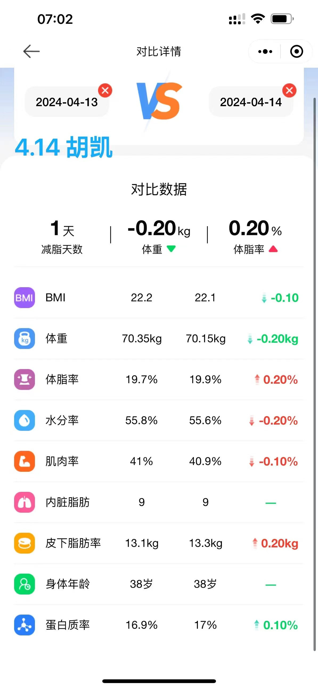

## 程序员的快乐减脂 ##  
___  
### 每日体脂记录（第一期） ###  
| **日期** | **BMI** | **体重(Kg)** | **体脂率(%)** | **水分率(%)** | **肌肉率(%)** | **内脏脂肪** | **皮下脂肪率(Kg)** | **身体年龄(岁)** | **蛋白质率(%)** |  
|:---|---:|---:|---:|---:|---:|---:|---:|---:|---:|
|[2024.4.3](img/240403-0.png "2024.4.3 体脂信息") |22.8|72.25|_21.0_|_54.9_|40.3|_10_|14.0|38|16.6|  
|[2024.4.4](img/240404-0.png "2024.4.4 体脂信息") |22.6|71.65|_20.7_|55.1|40.4|_10_|13.8|38|16.7|  
|[2024.4.5](img/240405-0.png "2024.4.5 体脂信息") |22.5|71.40|_20.5_|55.2|40.5|_10_|13.7|38|16.8|  
|[2024.4.6](img/240406-0.png "2024.4.6 体脂信息") |22.3|70.90|_20.3_|55.3|40.7|_9_|13.5|38|16.8|  
|[2024.4.7](img/240407-0.png "2024.4.7 体脂信息") |22.4|71.20|_20.5_|55.2|40.6|_10_|13.7|38|16.8|  
|[2024.4.8](img/240408-0.png "2024.4.8 体脂信息") |22.2|70.60|_20.1_|55.5|40.8|_9_|13.4|38|16.8|  
|[2024.4.9](img/240409-0.png "2024.4.9 体脂信息") |22.3|70.75|_20.2_|55.4|40.8|_9_|13.5|38|16.8|  
|[2024.4.10](img/240410-0.png "2024.4.10 体脂信息")|22.2|70.55|_20.1_|55.5|40.8|_9_|13.4|38|16.8|  
|[2024.4.11](img/240411-0.png "2024.4.11 体脂信息")|22.4|71.00|_20.3_|55.3|40.7|_9_|13.5|38|16.8|  
|[2024.4.12](img/240412-0.png "2024.4.12 体脂信息")|22.2|70.50|_19.8_|55.7|41.0|_9_|13.2|38|16.9|  
|[2024.4.13](img/240413-0.png "2024.4.13 体脂信息")|22.2|70.35|_19.7_|55.8|41.0|_9_|13.1|38|16.9|  
|[2024.4.14](img/240414-0.png "2024.4.14 体脂信息")|22.1|70.15|_19.9_|55.6|40.9|_9_|13.3|38|17.0|  
|[2024.4.15](img/240415-0.png "2024.4.15 体脂信息")|21.9|69.45|_19.7_|55.8|41.1|_9_|13.1|38|17.0|  
|[2024.4.16](img/240416-0.png "2024.4.16 体脂信息")|21.8|69.25|_19.2_|56.1|41.3|_9_|12.8|38|17.1|  
|[2024.4.17](img/240417-0.png "2024.4.17 体脂信息")|21.8|69.20|_19.3_|56.0|41.3|_9_|12.9|38|17.1|  
|[2024.4.18](img/240418-0.png "2024.4.18 体脂信息")|21.7|68.85|_18.8_|56.4|41.5|8|12.5|39|17.2|  
|[2024.4.19](img/240419-0.png "2024.4.19 体脂信息")|21.7|68.90|_18.9_|56.3|41.5|8|12.6|39|17.2|  
|[2024.4.20](img/240420-0.png "2024.4.20 体脂信息")|21.7|68.80|_19.0_|56.3|41.4|8|12.7|39|17.1|  
|[2024.4.21](img/240421-0.png "2024.4.21 体脂信息")|21.6|68.55|_18.8_|56.4|41.4|8|12.5|39|17.2|  
|[2024.4.22](img/240422-0.png "2024.4.22 体脂信息")|21.6|68.45|_18.7_|56.4|41.4|8|12.5|39|17.2|  
|[2024.4.23](img/240423-0.png "2024.4.23 体脂信息")|21.5|68.25|_18.5_|56.5|41.5|8|12.3|39|17.3|  
|[2024.4.24](img/240424-0.png "2024.4.24 体脂信息")|21.5|68.35|_18.5_|56.5|41.6|8|12.3|39|17.3|  
|**[一期总结](img/240423vs240403.png)**|**-1.3**|**-3.9**|**-2.5**|**1.6**|**1.3**|**-2**|**-1.7**|**1**|**0.7**|  
___  
### 每日体脂记录（第二期） ###    
| **日期** | **BMI** | **体重(Kg)** | **体脂率(%)** | **水分率(%)** | **肌肉率(%)** | **内脏脂肪** | **皮下脂肪率(Kg)** | **身体年龄(岁)** | **蛋白质率(%)** |  
|:---|---:|---:|---:|---:|---:|---:|---:|---:|---:|
|[2024.4.24](img/240424-0.png "2024.4.24 体脂信息")|21.5|68.35|_18.5_|56.5|41.6|8|12.3|39|17.3|  
|[2024.4.25](img/240425-0.png "2024.4.25 体脂信息")|21.4|68.10|_18.3_|56.6|41.7|8|12.2|39|17.4|  
|[2024.4.26](img/240426-0.png "2024.4.26 体脂信息")|21.5|68.35|_18.2_|56.7|41.8|8|12.1|39|17.4|  
|[2024.4.27](img/240427-0.png "2024.4.27 体脂信息")|21.3|67.65|_18.1_|56.8|41.8|8|12.1|39|17.4|  
|[2024.4.28](img/240428-0.png "2024.4.28 体脂信息")|21.5|68.20|_18.6_|56.4|41.6|8|12.4|39|17.3|  
|[2024.4.29](img/240429-0.png "2024.4.29 体脂信息")|21.2|67.40|_17.9_|56.9|42.0|8|11.9|39|17.4|  
|[2024.4.30](img/240430-0.png "2024.4.30 体脂信息")|21.3|67.80|_18.2_|56.7|41.8|8|12.1|39|17.4|  
|[2024.5.1](img/240501-0.png "2024.5.1 体脂信息")|21.3|67.55|_17.8_|57.0|42.0|8|11.9|39|17.4|  
|[2024.5.2](img/240502-0.png "2024.5.2 体脂信息")|21.3|67.60|_17.9_|56.9|41.9|8|11.9|39|17.5|  
|[2024.5.3](img/240503-0.png "2024.5.3 体脂信息")|21.2|67.45|_17.8_|57.0|42.0|8|11.9|39|17.4|  
|[2024.5.4](img/240504-0.png "2024.5.4 体脂信息")|21.2|67.25|_17.7_|57.1|42.0|8|11.8|39|17.4|  
|[2024.5.5](img/240505-0.png "2024.5.5 体脂信息")|21.1|67.10|_17.8_|57.0|41.9|7|11.9|39|17.4|  
|[2024.5.6](img/240506-0.png "2024.5.6 体脂信息")|21.1|67.05|_17.9_|56.9|41.9|7|11.9|39|17.4|  
|[2024.5.7](img/240507-0.png "2024.5.7 体脂信息")|21.3|67.50|_17.8_|57.0|42.0|8|11.9|39|17.4|  
|[2024.5.8](img/240508-0.png "2024.5.8 体脂信息")|21.2|67.35|_17.6_|57.1|42.1|8|11.7|39|17.5|  
|[2024.5.9](img/240509-0.png "2024.5.9 体脂信息")|21.1|66.95|_17.1_|57.5|42.4|7|11.4|39|17.6|  
|[2024.5.10](img/240510-0.png "2024.5.10 体脂信息")|21.3|67.70|_17.7_|57.1|42.0|8|11.8|39|17.4|  
|[2024.5.11](img/240511-0.png "2024.5.11 体脂信息")|21.1|67.00|_17.4_|57.3|42.2|7|11.6|39|17.5|  
|[2024.5.12](img/240512-0.png "2024.5.12 体脂信息")|21.0|66.65|_17.2_|57.4|42.2|7|11.5|39|17.6|  
|[2024.5.13](img/240513-0.png "2024.5.13 体脂信息")|20.9|66.30|_17.0_|57.6|42.4|7|11.3|39|17.5|  
|[2024.5.14](img/240514-0.png "2024.5.14 体脂信息")|20.9|66.45|_17.1_|57.5|42.3|7|11.4|39|17.5|  
|[2024.5.15](img/240515-0.png "2024.5.15 体脂信息")|21.0|66.75|_17.1_|57.5|42.3|7|11.4|39|17.6|  
|[2024.5.16](img/240516-0.png "2024.5.16 体脂信息")|20.9|66.35|16.8|57.7|42.4|7|11.2|38|17.6|  
|**[二期总结](img/240516vs240424.png)**|**-0.6**|**-2**|**-1.7**|**1.2**|**0.8**|**-1**|**-1.1**|**-1**|**0.3**| 
___  
### 两期数据汇总
| **日期** | **BMI** | **体重(Kg)** | **体脂率(%)** | **水分率(%)** | **肌肉率(%)** | **内脏脂肪** | **皮下脂肪率(Kg)** | **身体年龄(岁)** | **蛋白质率(%)** |  
|:---|---:|---:|---:|---:|---:|---:|---:|---:|---:|  
|[2024.4.3](img/240403-0.png "2024.4.3 体脂信息")|22.8|72.25|_21.0_|_54.9_|40.3|_10_|14.0|38|16.6|  
|[2024.4.24](img/240424-1.png "2024.4.24 体脂信息")|21.5|68.35|_18.5_|56.5|41.6|8|12.3|39|17.3| 
|[2024.5.16](img/240516-1.png "2024.5.16 体脂信息")|20.9|66.35|16.8|57.7|42.4|7|11.2|38|17.6| 
|**[两期合计](img/240516vs240403.png)**|**-1.9**|**-5.9**|**-4.2**|**2.8**|**2.1**|**-3**|**-2.8**|**0**|**1.0**|  

___  
### 饮食记录 ###    
| **日期** | **体脂信息** | **早餐（图）** | **早餐（字）** | **午餐（图）** | **午餐（字）** | **晚餐（图）** | **晚餐（字）** |  
|:---|:---:|---:|:---|---:|:---|---:|:---|  
| 2024.4.3   |     |  🍽️   |  代餐   |     |  菠菜、木耳；鸡胸肉；杂粮； |      |  青菜；牛肉；粗粮；   |
| 2024.4.4   |     |     |  金针菇+菠菜；煮鸡蛋2个；玉米；   |     |  莴笋+小白菜；洋葱鸡胸肉；杂粮；   |  🍽️   |  代餐   |
| 2024.4.5   |     |  🍽️   |  代餐   |     |  凉拌秋葵和木耳+青菜；鸡蛋炒虾仁；杂粮；   |  🍽️   |  代餐   |
| 2024.4.6   |     |  🍽️   |  代餐   |     |  杏鲍菇+生菜；虾仁+鸡蛋白；杂粮+玉米；   |     |  胡萝卜、金针菇、西葫芦、菠菜；鸡腿肉、虾仁、鸡蛋白；杂粮+玉米；   |
| 2024.4.7   |     |  🍽️   |  代餐   |     |  香菇炒青菜；牛肉炒芹菜；杂粮；   |  🍽️   |  代餐   |
| 2024.4.8   |     |     |  豆芽炒韭菜；鸡蛋白；番薯；   |     |  清炒紫甘蓝绿甘蓝；清蒸鱼和虾；粗粮；   |  🍽️   |  代餐   |
| 2024.4.9   |     |  🍽️   |  代餐   |     |  上海青；芦蒿炒牛肉；粗粮；   |  🍽️   |  代餐   |
| 2024.4.10  |    |  🍽️   |  代餐   |     |  凉拌黑白木耳+菠菜；清蒸鱼虾；粗粮；   |     |  韭菜炒豆芽；洋葱炒鸡胸肉；玉米；   |
| 2024.4.11  |    |     |  凉拌秋葵伴木耳；3个鸡蛋（1个蛋黄）；番薯；   |     |  清炒四季豆；鸡肉、鸭肉（去皮）；粗粮；   |  🍽️   |  代餐   |
| 2024.4.12  |    |  🍽️   |  代餐   |     | 凉拌紫甘蓝、金针菇、胡萝卜；芹菜炒牛肉；粗粮；    |  🍽️   |  代餐   |
| 2024.4.13  |    |  🍽️   |  代餐   |     | 木耳炒娃娃菜；青椒炒鸡腿肉；粗粮；    |     |  杏鲍菇炒上海青；墨鱼炒洋葱；粗粮；   |
| 2024.4.14  |    |  🍽️   |  代餐   |     | 上海青、木耳、芦蒿；豆腐；粗粮；    |  🍽️   |  代餐   |
| 2024.4.15  |    |     |  凉拌秋葵伴木耳；虾仁、2个鸡蛋（1个蛋黄）；蒸淮山；   |     |  青菜；青椒炒牛肉；粗粮；   |  🍽️   |  代餐   |
| 2024.4.16  |    |  🍽️   |  代餐   |     |  韭菜炒豆芽；虾仁拌豆腐；粗粮；   |  🍽️   |  代餐   |  
| 2024.4.17  |    |  🍽️   |  代餐   |   -  |  特殊情况，未进食   |     |  清炒莴笋；虾仁焖豆腐；粗粮；   |
| 2024.4.18  |    |     |  菠菜杏鲍菇；鸡蛋；山药；   |     |  娃娃菜、油麦菜；洋葱炒牛肉；粗粮；   |  🍽️   |  代餐   |
| 2024.4.19  |    |  🍽️   |  代餐   |     |  芦蒿炒香菇；虾仁炒豆腐；粗粮；   |  🍽️   |  代餐   |
| 2024.4.20  |    |  🍽️   |  代餐   |     |  黑白木耳伴青瓜；橙子皮炒牛肉；粗粮；   |     |  韭菜胡萝卜炒茭白；大蒜炒猪肝；红薯；   |
| 2024.4.21  |    |  🍽️   |  代餐   |     |  甘蓝炒韭菜；蒜香鱼片；粗粮；   |  🍽️   |  代餐   |
| 2024.4.22  |    |     |  凉拌杂菇木耳和菠菜；3个水煮鸡蛋（只吃1个蛋黄）；蒸玉米；   |     |  清炒蓬蒿；鱼头焖豆腐；粗粮；   |  🍽️   |  代餐   |
| 2024.4.23  |    |  🍽️   |  代餐   |     |  木耳炒茭白；虾；粗粮；   |  🍽️   |  代餐   |
| 2024.4.24  |    |  🍽️   |  代餐   |     |  杂菇炒青椒；虾仁炒鸡蛋；粗粮；   |     | 生菜；鸡胸肉；粗粮；    |
| 2024.4.25  |    |      |  凉拌红绿菠菜；2个鸡蛋；玉米；   |      |  清炒莴笋；鱼、虾、鸡胸肉；杂粮   |  🍽️   |  代餐   |    
| 2024.4.26  |    |  🍽️   |  代餐 |     |  黑白木耳炒韭菜；鲍汁豆腐虾仁；杂粮；   |  🍽️   |  代餐  |
| 2024.4.27  |    |  🍽️   |  代餐 |      |  黑白菇+青菜；清蒸油甘鱼；杂粮；   |     |  上海青；橙子皮炒牛肉+豆腐；蒸山药；   |
| 2024.4.28  |    |  🍽️   |  代餐 |      |  杂青菜；虾仁鸡腿肉；糯玉米；   |   🍽️   |  代餐   |
| 2024.4.29  |    |     |  杂菇；鸡腿肉、虾仁、水煮鸡蛋；红薯；   |      |  茼蒿；豆腐、虾仁；杂粮；   |  🍽️   |  代餐  |
| 2024.4.30  |    |  🍽️   |  代餐 |     |  白菜炒木耳；鸭腿；杂粮；   |   🍽️   |  代餐  |
| 2024.5.1   |    |  劳  |  动 |  人   |  民   |  节   |  日   |
| 2024.5.2   |    |  劳  |  动 |  创   |  造   |  幸   |  福   |
| 2024.5.3   |    |  三  |  天 |  自   |  由   |  饮   |  食   |
| 2024.5.4   |    |     |  凉拌 绣球菌+金针菇+菠菜；清蒸油甘鱼；饭团；   |     |  茭白炒韭菜；鱼籽煎蛋；米饭；   |  🍽️   |  代餐 |
| 2024.5.5   |    |  🍽️   |  代餐 |     |  娃娃菜；红烧鱼；米饭；   |  🍽️   |  代餐  |
| 2024.5.6   |    |  🍽️   |  代餐 |     |  空心菜；豆腐焖鱼；杂粮；  |      | 鹿茸菇茶树菇炒彩椒；虾仁；米饭； |
| 2024.5.7   |    |     |  青菜；鸡蛋；杂粮；   |     |  木耳丝炒莴笋；洋葱炒牛肉；粗粮；   |  🍽️   |  代餐   |
| 2024.5.8   |    |  🍽️   |  代餐  |   |  清炒娃娃菜；豆腐焖鱼；粗粮；   |   🍽️   |  代餐  |
| 2024.5.9   |    |  🍽️   |  代餐  |   |  手撕包菜；毛豆焖鱼；粗粮；   |     |  小白菜+茼蒿；白灼樱花虾；粗粮；   |
| 2024.5.10  |    | 🍽️   |  代餐  |   |  青菜；银鱼炒蛋；粗粮；   |  🍽️   |  代餐  |
| 2024.5.11  |    |  |  豆芽炒韭菜；鸡蛋；花糯玉米；   |     | 凉拌金针菇+香菇+雪熔菇+菠菜；红烧鱼；粗粮； | 🍽️   |  代餐 |
| 2024.5.12  |    |  🍽️   |  代餐  |     |  青菜；豆腐焖鱼；米饭；   |   🍽️   |  代餐 |
| 2024.5.13  |    |  🍽️   |  代餐  |     |  杭白菜；彩椒炒牛肉；粗粮；   |     | 木耳炒豆芽；煎蛋+虾；粗粮；   |
| 2024.5.14  |    |    |  凉拌黑白木耳和蘑菇；虾仁、鸡蛋；花糯玉米；   |    |  桑叶芽；红烧鱼；粗粮；   |  🍽️   |  代餐  |
| 2024.5.15  |    |  🍽️   |  代餐  |     | 包菜；香干毛豆；粗粮； |  🍽️   |  代餐  |
| 2024.5.16  |    |  🍽️   |  代餐  |    |  空心菜；虾仁；粗粮；   |     | 青菜；鸡蛋；油豆腐包鱼籽；低糖生日蛋糕、水果；  |
___  